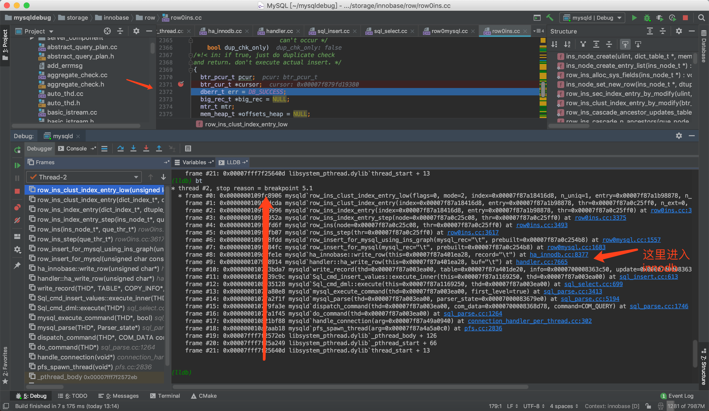

在 客户端 执行一条插入语句

在执行到：dberr_t row_ins_clust_index_entry_low 方法的时候适应lldb打印调用栈

```
(lldb) bt
* thread #2, stop reason = breakpoint 5.1
  * frame #0: 0x0000000109fc8906 mysqld`row_ins_clust_index_entry_low(flags=0, mode=2, index=0x00007f87a18416d8, n_uniq=1, entry=0x00007f87a1b98878, n_ext=0, thr=0x00007f87a0c25ff0, dup_chk_only=false) at row0ins.cc:2372
    frame #1: 0x0000000109fcdcda mysqld`row_ins_clust_index_entry(index=0x00007f87a18416d8, entry=0x00007f87a1b98878, thr=0x00007f87a0c25ff0, n_ext=0, dup_chk_only=false) at row0ins.cc:3110
    frame #2: 0x0000000109fd9996 mysqld`row_ins_index_entry(index=0x00007f87a18416d8, entry=0x00007f87a1b98878, thr=0x00007f87a0c25ff0) at row0ins.cc:3241
    frame #3: 0x0000000109fd952a mysqld`row_ins_index_entry_step(node=0x00007f87a0c25c08, thr=0x00007f87a0c25ff0) at row0ins.cc:3375
    frame #4: 0x0000000109fcfd6f mysqld`row_ins(node=0x00007f87a0c25c08, thr=0x00007f87a0c25ff0) at row0ins.cc:3493
    frame #5: 0x0000000109fcfb07 mysqld`row_ins_step(thr=0x00007f87a0c25ff0) at row0ins.cc:3617
    frame #6: 0x0000000109ff8fdd mysqld`row_insert_for_mysql_using_ins_graph(mysql_rec="\t", prebuilt=0x00007f87a0c254b8) at row0mysql.cc:1557
    frame #7: 0x0000000109ff84fc mysqld`row_insert_for_mysql(mysql_rec="\t", prebuilt=0x00007f87a0c254b8) at row0mysql.cc:1683
    frame #8: 0x0000000109d0fe1e mysqld`ha_innobase::write_row(this=0x00007f87a401ea28, record="\t") at ha_innodb.cc:8377
    frame #9: 0x00000001079d8914 mysqld`handler::ha_write_row(this=0x00007f87a401ea28, buf="\t") at handler.cc:7665
    frame #10: 0x0000000107f3bda7 mysqld`write_record(thd=0x00007f87a003ea00, table=0x00007f87a401de20, info=0x0000700008363c50, update=0x0000700008363bd8) at sql_insert.cc:1915
    frame #11: 0x0000000107f39c9c mysqld`Sql_cmd_insert_values::execute_inner(this=0x00007f87a1169250, thd=0x00007f87a003ea00) at sql_insert.cc:613
    frame #12: 0x0000000108035128 mysqld`Sql_cmd_dml::execute(this=0x00007f87a1169250, thd=0x00007f87a003ea00) at sql_select.cc:699
    frame #13: 0x0000000107fa80e8 mysqld`mysql_execute_command(thd=0x00007f87a003ea00, first_level=true) at sql_parse.cc:3413
    frame #14: 0x0000000107fa2f1f mysqld`mysql_parse(thd=0x00007f87a003ea00, parser_state=0x00007000083679e0) at sql_parse.cc:5194
    frame #15: 0x0000000107f9fa3e mysqld`dispatch_command(thd=0x00007f87a003ea00, com_data=0x0000700008368d78, command=COM_QUERY) at sql_parse.cc:1746
    frame #16: 0x0000000107fa1f45 mysqld`do_command(thd=0x00007f87a003ea00) at sql_parse.cc:1264
    frame #17: 0x000000010821bf88 mysqld`handle_connection(arg=0x00007f87a49a0940) at connection_handler_per_thread.cc:302
    frame #18: 0x000000010a2aab18 mysqld`pfs_spawn_thread(arg=0x00007f87a4a5a0c0) at pfs.cc:2836
    frame #19: 0x00007fff7f2572eb libsystem_pthread.dylib`_pthread_body + 126
    frame #20: 0x00007fff7f25a249 libsystem_pthread.dylib`_pthread_start + 66
    frame #21: 0x00007fff7f25640d libsystem_pthread.dylib`thread_start + 13
```


调用栈如图所示：
从 sql 到 innodb 引擎



分析：  
从栈的深度看有20多层，从mysql-server层到innodb引擎层

上层server层  主要是分析sql语句 

关键是innodb层  
中间涉及到   
    事务，事务的创建，事务的隔离级别判断，
    锁，在插入的时候，先执行的是查询，判断是否能插入 这中间如果有并发会涉及到 readview ，lock ，transaction 等机制
    
最终是插在了 b+ 数的一个叶子节点上 这是逻辑结构， 在磁盘上存储在了文件中  
这中间涉及到了 binglog server层的日志 逻辑日志  ，redolog，innod的日志 物理文件，用于性能，中间涉及到缓存，  
还有 undolog 中间涉及到 回滚操作
buffer 

这只是一条插入语句，并不能体现出来，innodb处理并发的能力

mvcc 多版本并发控制 的性能还不能体现出来

行锁和间隙锁的分析  幻读的现象还不能体现出来， 后边会做实验来分析这种线程（因为clion，可以切换线程调试，所以使用两个客户端就
可以模拟出来多个事务并行的的时候 innodb 是如何加锁（行锁和间隙锁）
，如何控制隔离（mvcc ），以及视图规则 ）
    
