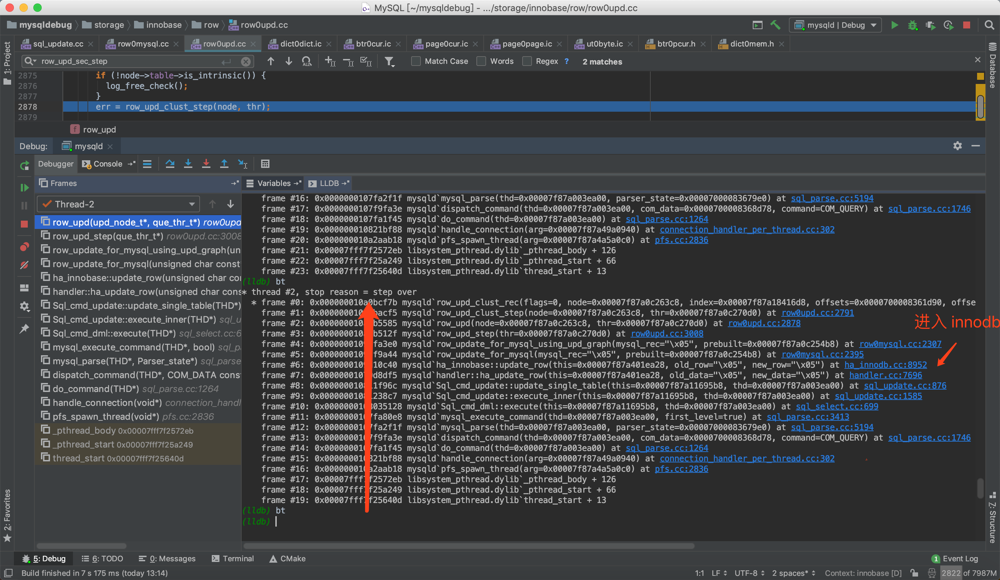

在 客户端 执行 一条更行语句 

执行到 方法 row_upd_clust_step

```
(lldb) bt
* thread #2, stop reason = step over
  * frame #0: 0x000000010a0bcf7b mysqld`row_upd_clust_rec(flags=0, node=0x00007f87a0c263c8, index=0x00007f87a18416d8, offsets=0x0000700008361d90, offsets_heap=0x0000700008361d48, thr=0x00007f87a0c270d0, mtr=0x00007000083620b0) at row0upd.cc:2595
    frame #1: 0x000000010a0bacf5 mysqld`row_upd_clust_step(node=0x00007f87a0c263c8, thr=0x00007f87a0c270d0) at row0upd.cc:2791
    frame #2: 0x000000010a0b5585 mysqld`row_upd(node=0x00007f87a0c263c8, thr=0x00007f87a0c270d0) at row0upd.cc:2878
    frame #3: 0x000000010a0b512f mysqld`row_upd_step(thr=0x00007f87a0c270d0) at row0upd.cc:3008
    frame #4: 0x0000000109ffa3e0 mysqld`row_update_for_mysql_using_upd_graph(mysql_rec="\x05", prebuilt=0x00007f87a0c254b8) at row0mysql.cc:2307
    frame #5: 0x0000000109ff9a44 mysqld`row_update_for_mysql(mysql_rec="\x05", prebuilt=0x00007f87a0c254b8) at row0mysql.cc:2395
    frame #6: 0x0000000109d10c40 mysqld`ha_innobase::update_row(this=0x00007f87a401ea28, old_row="\x05", new_row="\x05") at ha_innodb.cc:8952
    frame #7: 0x00000001079d8df5 mysqld`handler::ha_update_row(this=0x00007f87a401ea28, old_data="\x05", new_data="\x05") at handler.cc:7696
    frame #8: 0x000000010811f96c mysqld`Sql_cmd_update::update_single_table(this=0x00007f87a11695b8, thd=0x00007f87a003ea00) at sql_update.cc:876
    frame #9: 0x00000001081238c7 mysqld`Sql_cmd_update::execute_inner(this=0x00007f87a11695b8, thd=0x00007f87a003ea00) at sql_update.cc:1585
    frame #10: 0x0000000108035128 mysqld`Sql_cmd_dml::execute(this=0x00007f87a11695b8, thd=0x00007f87a003ea00) at sql_select.cc:699
    frame #11: 0x0000000107fa80e8 mysqld`mysql_execute_command(thd=0x00007f87a003ea00, first_level=true) at sql_parse.cc:3413
    frame #12: 0x0000000107fa2f1f mysqld`mysql_parse(thd=0x00007f87a003ea00, parser_state=0x00007000083679e0) at sql_parse.cc:5194
    frame #13: 0x0000000107f9fa3e mysqld`dispatch_command(thd=0x00007f87a003ea00, com_data=0x0000700008368d78, command=COM_QUERY) at sql_parse.cc:1746
    frame #14: 0x0000000107fa1f45 mysqld`do_command(thd=0x00007f87a003ea00) at sql_parse.cc:1264
    frame #15: 0x000000010821bf88 mysqld`handle_connection(arg=0x00007f87a49a0940) at connection_handler_per_thread.cc:302
    frame #16: 0x000000010a2aab18 mysqld`pfs_spawn_thread(arg=0x00007f87a4a5a0c0) at pfs.cc:2836
    frame #17: 0x00007fff7f2572eb libsystem_pthread.dylib`_pthread_body + 126
    frame #18: 0x00007fff7f25a249 libsystem_pthread.dylib`_pthread_start + 66
    frame #19: 0x00007fff7f25640d libsystem_pthread.dylib`thread_start + 13
```

调用栈如图所示：
