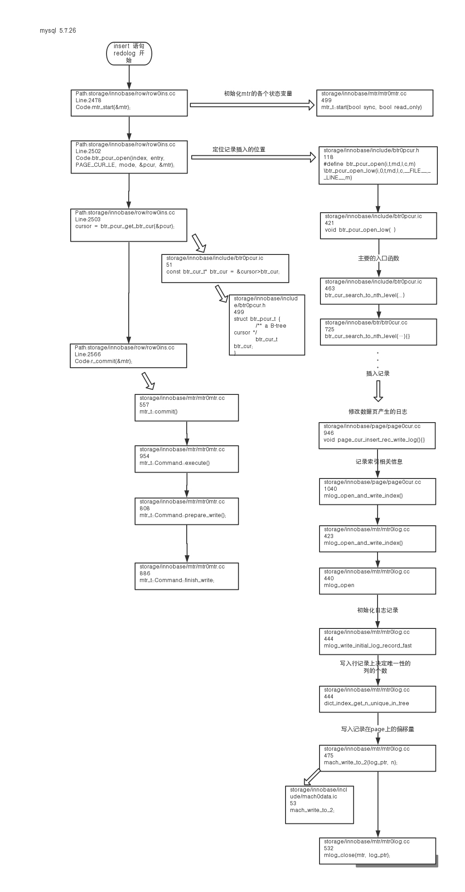

引用的几篇文章资料 

> MySQL中的重做日志（redo log），回滚日志（undo log），以及二进制日志（binlog）的简单总结
[http://www.importnew.com/28039.html](http://www.importnew.com/28039.html)

>InnoDB redo log格式-物理log
[https://blog.51cto.com/yanzongshuai/2095349](https://blog.51cto.com/yanzongshuai/2095349)

>详细分析MySQL的日志(一)
[https://www.cnblogs.com/f-ck-need-u/p/9001061.html#blog5](https://www.cnblogs.com/f-ck-need-u/p/9001061.html#blog5)

>mysql如何保证redolog和binlog的一致性,安全性,效率。
[https://blog.51cto.com/dwchaoyue/1784509](https://blog.51cto.com/dwchaoyue/1784509)

>Mysql-事务与Redo Log、Undo Log
[https://yq.aliyun.com/articles/592937](https://yq.aliyun.com/articles/592937)

>详细分析MySQL事务日志(redo log和undo log)    
[https://juejin.im/entry/5ba0a254e51d450e735e4a1f](https://juejin.im/entry/5ba0a254e51d450e735e4a1f)

>MySQL · 引擎特性 · InnoDB redo log漫游
[https://www.kancloud.cn/taobaomysql/monthly/67037](https://www.kancloud.cn/taobaomysql/monthly/67037)

>mysql 的S 锁和X锁的区别
[https://blog.csdn.net/qq_39478853/article/details/80623575](https://blog.csdn.net/qq_39478853/article/details/80623575)

比较有价值的几篇  
详细分析MySQL事务日志(redo log和undo log)    
MySQL · 引擎特性 · InnoDB redo log漫游    

参考源码 mysql 5.7.26  

# redo log、、
参考
MySQL · 引擎特性 · InnoDB redo log漫游    

> 找了好久终于找到你  

## insert语句 开始写 redolog 

上下文：切换
src/files/note01_追踪一条插入语句的源码.md
line: 2444
code：dberr_t row_ins_clust_index_entry_low(

path: storage/innobase/row/row0ins.cc
line：2478
code：mtr_start(&mtr);
      mtr.set_named_space(index->space); 
      
> Mini transaction(简称mtr)是InnoDB对物理数据文件操作的最小事务单元，
用于管理对Page加锁、修改、释放、以及日志提交到公共buffer等工作。
一个mtr操作必须是原子的，一个事务可以包含多个mtr。
每个mtr完成后需要将本地产生的日志拷贝到公共缓冲区，将修改的脏页放到flush list上。      

