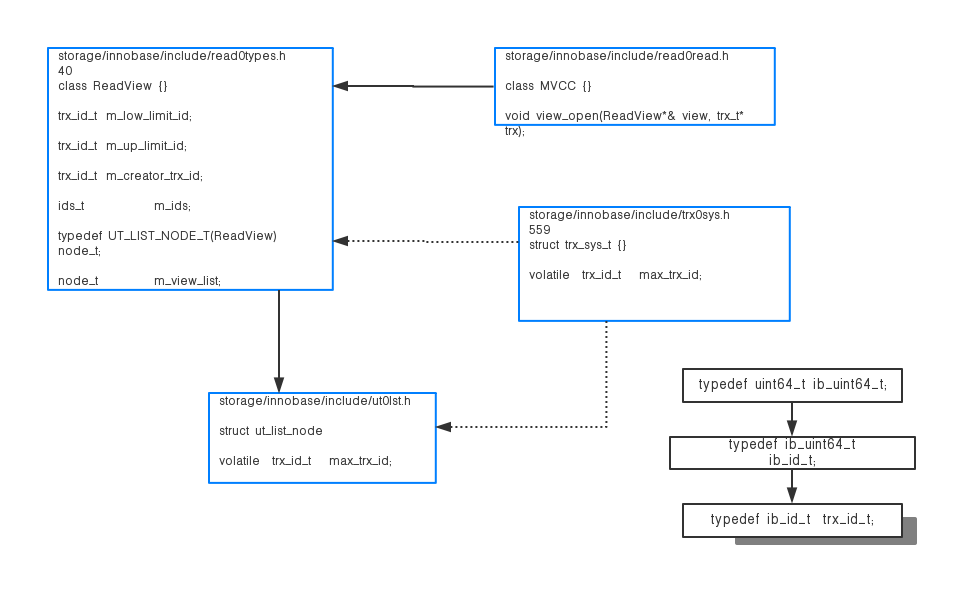

# 1、原理介绍
数据多版本(MVCC)是MySQL实现高性能的一个主要的一个主要方式，通过对普通的SELECT不加锁，
直接利用MVCC读取指版本的值，避免了对数据重复加锁的过程。InnoDB支持MVCC多版本，其中RC和RR隔离级别是利用consistent read view方式支持的，
即在某个时刻对事物系统打快照记下所有活跃读写事务ID，之后读操作根据事务ID与快照中的事务ID进行比较，判断可见性。


行结构中，除了用户定义的列外还有3个系统列：
DATA_ROW_ID、DATA_TRX_ID、DATA_ROLL_PTR，
如果表没有定义主键那么DATA_ROW_ID作为主键列，否则行结构中没有DATA_ROW_ID列。其中：

```  
DATA_TRX_ID:修改该行数据的事务的ID

DATA_ROLL_PTR：指向该行回滚段的指针。
```


# 4、READ-VIEW解读

1）read view是和SQL语句绑定的，在每个SQL语句执行前申请或获取

（RR隔离级别：事务第一个select申请，之后都用这个；RC隔离级别：每个select都会申请）


2）read view结构

主要包括3个成员{low_limit_id,up_limit_id,trx_ids}。

```  
low_limit_id：表示创建read view时，当前事务活跃读写链表最大的事务ID，即最近创建的除自身外最大的事务ID

up_limit_id：表示创建read view时，当前事务活跃读写链表最小的事务ID。

trx_ids：创建read view时，活跃事务链表里所有事务ID

```

4）对于可见性判断，分配聚集索引和二级索引。聚集索引：

聚集索引：  

 记录的DATA_TRX_ID < view->up_limit_id：在创建read view时，修改该记录的事务已提交，该记录可见


二级索引：  
由于InnoDB的二级索引只保存page最后更新的trx_id，当利用二级索引进行查询的时候，
如果page的trx_id小于view->up_limit_id，可以直接判断page的所有记录对于当前view是可见的，否则需要回clustered索引进行判断。

5）如果记录对于view不可见，需要通过记录的DB_ROLL_PTR指针遍历history list构造当前view可见版本数据


6）start transaction和begin语句执行后并没有在innodb层分配事务ID、
回滚段、read_view、将事务放到读写事务链表等，

这个操作需要第一个SQL语句调用函数trx_start_low来完成，这个需要注意。





