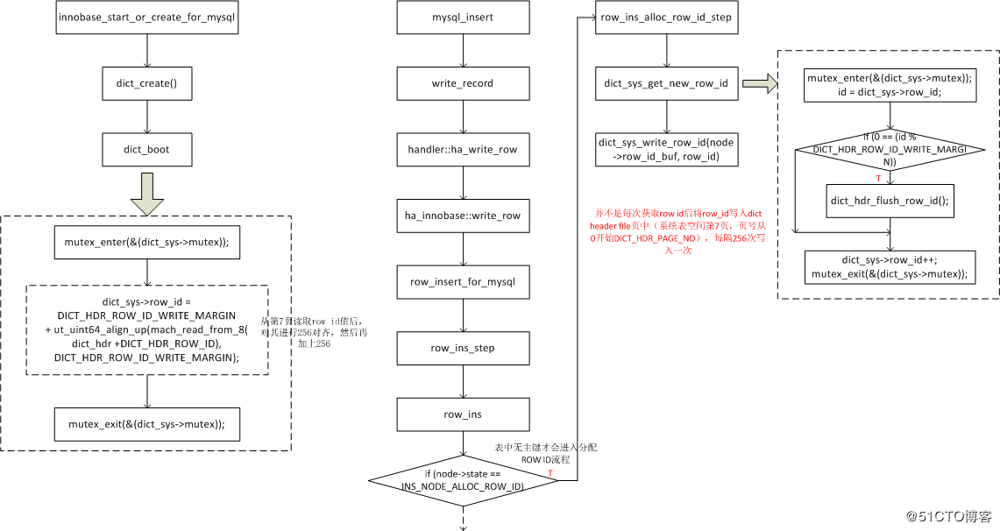
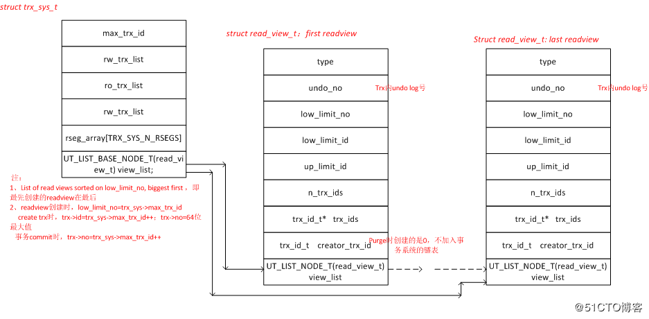

# InnoDB rowid管理

在innodb表中，并不是每个行记录都存有row ID，只有表定义没有主键时，才会使用rowid并作为主键。rowid的分配是全局的，所有的表都共享这个ID，即从在dict_sys->mutex锁内获取dict_sys->row_id中的值。

并不是每次插入操作都将rowid的值写入到字典页面中，插入操作相对于建表等操作频繁多了，所以如果每次都写入字典页面中的话，将会影响效率。innoDB做了一个优化，每分配一个rowid，只在内存中+1，只有当这个值是256的倍数时才写入一次。重启时，
从字典页面读取rowid值，并对其256对齐然后加上256，供以后分配rowid使用。不会因为重启重复使用以前已经使过的rowid。

# purge原理-readview和trx关系

